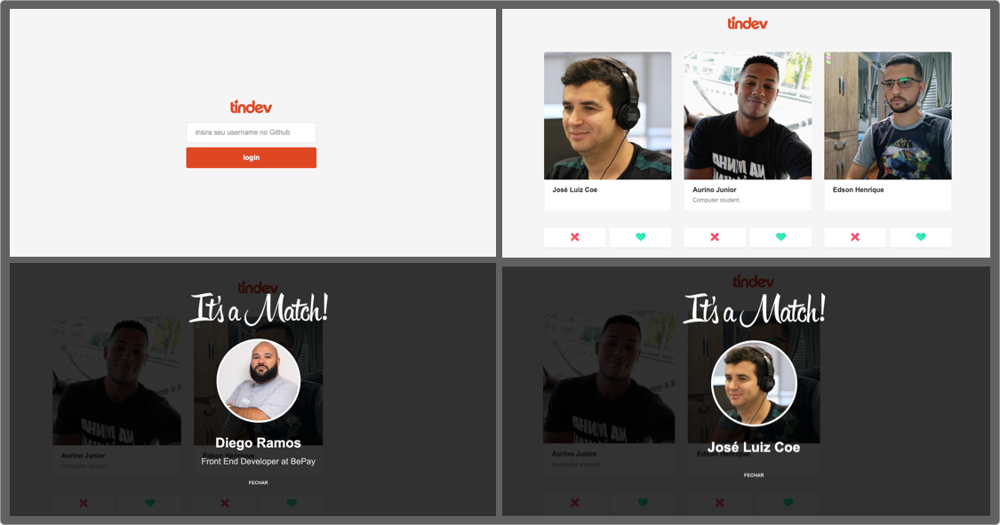

# application | TINDEV - FRONTEND



## About This Project

This project contains the entire frontend of the **[application-tindev-frontend](https://github.com/coderamos/application-tindev-frontend)** application. Match other developers.

This project was create with [Create React App](https://facebook.github.io/create-react-app/). You can learn more in the [Create React App documentation](https://facebook.github.io/create-react-app/docs/getting-started). To learn React, check out the [React documentation](https://reactjs.org/).

To know the **backend** of this application, visit [application-tindev-backend](https://github.com/coderamos/application-tindev-backend).

## Avaliable Scripts

### Run Project

In the project directory, you can run:

```
yarn install
```

and

```
yarn start
```

Learn how to install `yarn` through the [official documentation](https://yarnpkg.com/pt-BR/docs/install).

Run the app in the development mode by opening [http://localhost:3000](http://localhost:3000) to view it in the browser.

The page will reload if you make edits. You will also see any lint errors in the console.

## Tecnologies Used

#### Axios

> To make queries on external API's.

#### React Router Dom

> To manage the application routing system.

#### Socket.io

> To communicate backend with the frontend in real-time.

## About Me

My Github profile: https://github.com/coderamos/

My Linkedin profile: https://www.linkedin.com/in/coderamos/
